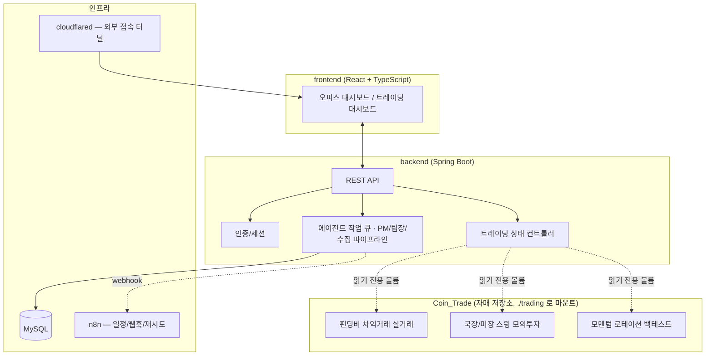

<div align="center">

# 🧠 AI_Ochestration

**개인용 AI 오케스트레이션 플랫폼 — 멀티 에이전트 지식 아카이브 · 보안/경제 정보 수집 · 트레이딩 대시보드**


</div>

---

## 목차

1. [이 저장소는 무엇인가](#이-저장소는-무엇인가)
2. [핵심 기능](#핵심-기능)
3. [아키텍처](#아키텍처)
4. [디렉터리 구조](#디렉터리-구조)
5. [빠르게 시작하기](#빠르게-시작하기)
6. [에이전트 모델 구성](#에이전트-모델-구성)
7. [트레이딩 대시보드 & Coin_Trade](#트레이딩-대시보드--coin_trade)
8. [파일 저장소 & n8n](#파일-저장소--n8n)
9. [보안 메모](#보안-메모)

---

## 이 저장소는 무엇인가

개인이 혼자 운영하는 **"AI 사무실"** 컨셉의 자동화 플랫폼입니다. 2D 오피스 대시보드 안에 여러 역할의 AI 에이전트(PM · 팀장 · 수집 담당 · 검토 담당 · 아카이브 담당)가 배치되어 있고, 보안/경제 분야 정보를 자동 수집 → 상호 검토 → 팀장 종합 → PM 승인 → 지식 아카이브(Obsidian 호환 Markdown) 저장까지의 파이프라인을 처리합니다.

여기에 더해, 자동매매 봇들의 실시간 현황을 보여주는 **트레이딩 대시보드**도 이 저장소의 백엔드/프런트엔드가 담당합니다(실제 매매 로직은 자매 저장소 [`Coin_Trade`](#트레이딩-대시보드--coin_trade)에 있습니다).

## 핵심 기능

| 영역 | 설명 |
|---|---|
| 🏢 **2D 오피스 대시보드** | 에이전트들이 실제로 "일하는" 모습을 시각화한 React 기반 UI |
| 📰 **보안/경제 정보 수집** | 등록된 출처를 주기적으로 크롤링 → Gemini/DeepSeek/GPT 멀티모델 검토 파이프라인 → Markdown 아카이브 |
| 🗂️ **지식 아카이브(Obsidian 호환)** | 원본 보존(`originals/`) + AI가 가공한 노트(`obsidian/`) 분리 저장, 중복 병합·주간 정리 자동화 |
| 📅 **보안 캘린더** | 보안 이벤트/세미나/인시던트를 월별로 추적 |
| 📈 **트레이딩 대시보드** | 크립토 실거래(펀딩비 차익거래) · 국장/미장 모의투자 스윙봇 · 모멘텀 로테이션 백테스트 현황을 실시간 표시 |
| 🔁 **n8n 워크플로 연동** | 일정·웹훅·재시도가 필요한 실행 흐름(다이제스트 발송, Slack 알림 등)을 n8n이 전담 |
| 💰 **LLM 비용 추적** | Gemini/DeepSeek/GPT/Bedrock 호출 비용을 모델별로 추정·집계, 월 예산 초과 시 대시보드에 경고 |

## 아키텍처



## 디렉터리 구조

```
AI_Ochestration/
├── docker-compose.yml       # mysql · api · web · n8n · cloudflared · trading-* 서비스 정의
├── .env.example             # 환경 변수 템플릿
├── backend/                 # Spring Boot API
│   └── src/main/java/com/orchestration/
│       ├── auth/            # 인증/세션
│       ├── calendar/        # 보안 캘린더
│       ├── files/           # 원본 파일 감지 · Obsidian 아카이브 관리
│       ├── n8n/             # n8n 웹훅 디스패치
│       ├── sources/         # 수집 사이트 등록/크롤링/배치 제출
│       ├── tasks/           # PM·팀장·수집·검토 에이전트 워크플로
│       ├── todo/            # 할 일 목록
│       └── trading/         # 트레이딩 상태 REST 컨트롤러 (크립토/국장/미장/모멘텀)
├── frontend/                # React + TypeScript (Vite)
│   └── src/App.tsx          # 오피스 대시보드 + 전체 트레이딩 대시보드 UI
├── n8n/workflows/           # 다이제스트·아카이브·트레이딩 중단 알림 워크플로 템플릿
├── originals/               # 원본 파일 보관(수정하지 않음)
├── obsidian/                # AI가 가공한 Markdown 지식베이스
├── scripts/db-backup.sh     # MySQL 자동 백업 스크립트
├── docs/trading-agent-plan.md
└── trading/                 # ← Coin_Trade 저장소를 여기에 클론 (이 저장소에는 포함 안 됨)
```

## 빠르게 시작하기

이 플랫폼은 **트레이딩 기능까지 포함해서 통째로 하나의 `docker compose`로 기동**하도록 설계되어 있습니다. 트레이딩 봇 코드는 별도 저장소([`Coin_Trade`](https://github.com/khsqowp/Coin_Trade))에 있으므로, `trading/` 폴더 자리에 그 저장소를 클론해야 합니다.

```bash
git clone https://github.com/khsqowp/AI_Ochestration.git
cd AI_Ochestration
git clone https://github.com/khsqowp/Coin_Trade.git trading

cp .env.example .env
# .env 열어서 비밀번호·API 키 채우기 (아래 "보안 메모" 참고)

# 오케스트레이션 플랫폼만 기동 (트레이딩 봇 제외)
docker compose up --build -d

# 트레이딩 봇까지 전부 기동하고 싶다면 profile을 추가
docker compose --profile paper-trading --profile kr-swing --profile us-swing --profile momentum-rotation up --build -d
```

`http://localhost:5173`에서 대시보드를 엽니다. 개발 단계 기본값(`AUTH_ENABLED=false`)에서는 관리자 세션이 자동 생성되어 별도 로그인 없이 바로 확인할 수 있습니다.

> 트레이딩 대시보드까지는 필요 없고 지식 아카이브/수집 기능만 쓰고 싶다면 `trading/` 폴더를 클론하지 않고 `docker compose up`(트레이딩 profile 없이)만 실행해도 됩니다 — `api`/`web` 서비스는 트레이딩 상태 파일이 없으면 빈 대시보드를 보여줄 뿐, 에러가 나지 않습니다.

## 에이전트 모델 구성

| 역할 | 모델 |
|---|---|
| PM | DeepSeek V4-Pro |
| 보안·경제 팀장 | DeepSeek V4-Pro Thinking |
| 보안·경제 수집 담당 | Gemini 2.5 Flash |
| 상호 재검토 담당 (2명) | GPT-4o mini |
| 아카이브 담당 | 원본 보존, Markdown·링크·폴더 구조 관리 |

Gemini 수집 호출은 기본 최대 15분(`GEMINI_TIMEOUT_SECONDS`)까지 대기하고, GPT/DeepSeek의 검토·판단 호출은 기본 3분(`DECISION_TIMEOUT_SECONDS`)으로 별도 제한합니다. 팀장의 장문 아카이브 작성은 더 길게(`LONG_FORM_TIMEOUT_SECONDS`, 기본 7분) 허용합니다.

## 트레이딩 대시보드 & Coin_Trade

`backend/src/main/java/com/orchestration/trading/`의 4개 컨트롤러가 각각 아래 봇들의 상태 파일을 읽어 REST API로 내려줍니다.

| API | 대상 봇 | 실행 저장소 |
|---|---|---|
| `GET /api/trading/state` | 펀딩비 차익거래 (실거래) | Coin_Trade |
| `GET /api/trading/kr/state` | 국내주식 스윙 (모의투자) | Coin_Trade |
| `GET /api/trading/us/state` | 미국주식 스윙 (모의투자) | Coin_Trade |
| `GET /api/trading/momentum-rotation/state` | 모멘텀 로테이션 (백테스트/페이퍼) | Coin_Trade |

각 봇 컨테이너가 Docker named volume에 JSON 상태 파일을 쓰면, `api` 서비스가 해당 볼륨을 읽기 전용(`:ro`)으로 마운트해서 읽습니다 — 매매 로직과 대시보드 표시 로직이 완전히 분리되어 있는 구조입니다. 실제 매매 전략의 상세 설명은 [Coin_Trade README](https://github.com/khsqowp/Coin_Trade)를 참고하세요.

## 파일 저장소 & n8n

- `originals/`: 맥에서 직접 넣거나 화면으로 올린 원본 파일. 원본은 수정하지 않습니다.
- `obsidian/`: AI가 가공한 Markdown, 링크 노트, 요약 기록을 보관할 Obsidian 호환 지식베이스입니다.

API 컨테이너는 `originals/`을 주기적으로 감지합니다. 새 파일은 변환 작업 큐에 등록되고, 웹 화면의 **수집 사이트** 메뉴에서 등록한 보안/경제 출처는 기본 30분마다 대상 여부를 확인해 각 사이트의 설정 주기(기본 6시간)에 맞춰 원문을 `originals/web/`에 보관합니다. 로컬·사설 네트워크 주소와 2MB를 초과하는 응답은 수집하지 않습니다.

`http://localhost:5678`에서 n8n을 열 수 있습니다. n8n은 일정·웹훅·재시도 같은 실행 흐름만 담당하고, 작업·에이전트 상태의 기준 데이터는 계속 MySQL/Spring Boot에 둡니다. `n8n/workflows/*.json`은 시작 템플릿이므로 n8n UI에서 import한 뒤 활성화하고, 실제 Slack 웹훅 등 자격 증명은 코드에 넣지 말고 n8n의 Credentials 기능으로 등록하세요.

## 보안 메모

- `.env`는 저장소에 절대 넣지 않습니다(`.gitignore`에 포함되어 있으며, `.env.example`만 커밋됩니다).
- API 키는 서버 환경 변수에서만 읽고, 응답·로그·Markdown에 기록하지 않습니다.
- `N8N_ENCRYPTION_KEY`는 n8n 자격 증명 암호화 키이므로 실제 랜덤 문자열로 바꾼 뒤 유지합니다. 바꾸면 기존 n8n 자격 증명을 복호화할 수 없습니다.
- 운영 환경에서는 `AUTH_ENABLED=true`, HTTPS, `AUTH_COOKIE_SECURE=true`를 반드시 적용해야 합니다.
- 트레이딩 관련 API 키(`BINANCE_API_KEY` 등)에는 출금 권한을 부여하지 마세요 — 자세한 내용은 [Coin_Trade README의 안전 수칙](https://github.com/khsqowp/Coin_Trade#안전-수칙--주의사항)을 참고하세요.
